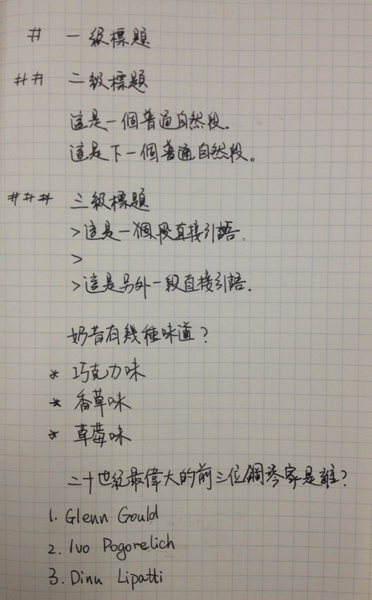

# 纯文本之markdown格式

> 鼓励大家使用markdown写纯文本文档

## markdown是什么

- markdown诞生于互联网时代，正如大标题所说，markdown其实就是用于编辑我们熟知的纯文本文档的一种格式，只不过我们常用`.txt .html .doc`这些格式，当然，markdown文档的后缀为`.md`
- 相信我这么讲，你已经开始觉得markdown很亲切了，没错，我们写过太多这类`.txt .doc`的纯文本文档了，写过网页的人更加明白纯文本都包括哪些内容，无非就是标题、段落、超链接等等
- 所以你可以大胆的猜想，`.md`文档到底长什么样

## 一份markdown格式的手写稿

> 仅为写作而生，与人类的写作习惯一脉相承

## 特点

- 纯文本，可以使用所有纯文本编辑器进行编辑，比如记事本，写完后保存为`.md`即可
- 兼容性强，对比`.txt .doc`格式的纯文本文档，优势明显，比如`.txt`文档只能在windows打开，`.doc`文档不能向上兼容高版本
- 具有极好的可读性，专注于文字内容，排版简洁
- 可以轻松转换为html格式，电子书格式，当然这个转换的工作不需要你完成

## 推荐对象

- web开发者

> 目前markdown文本在web开发者界已经非常流行，多用于写个人博客，科技文等，悄悄告诉大家，本人的博客就是全用markdown写的，你心动了吗

- 写作爱好者

> 使用markdown写文章，你可以更专注于写作，不用浪费时间在排版上，还有那该死的Word

- everyone

> 有了markdown，你还想写txt文档吗

## 推荐理由
为什么markdown如此受欢迎，不是因为它看起来好像很复杂，是因为它用起来就是那么简单，不信？返回Markdown入门目录去体验它简洁的语法吧！