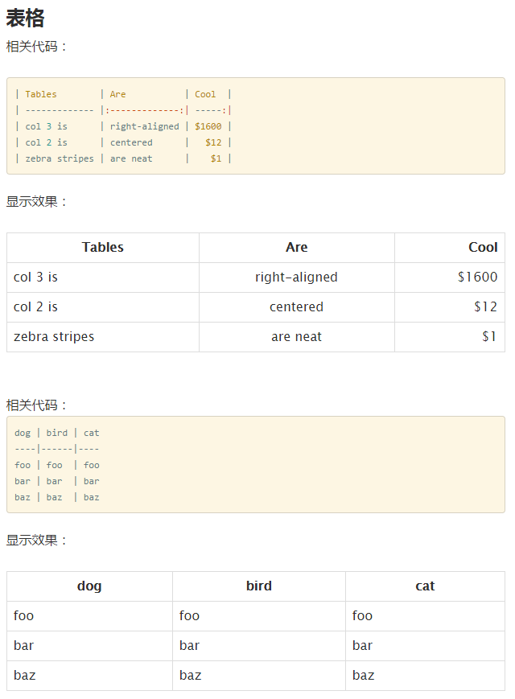

# markdown简洁的语法

> 语法简洁超乎你想象，开始学习吧！

## 标题

> 在word中你需要选中文本然后设置为标题格式；在txt文档中，直接就是一堆文字，啥格式都没有；

在markdown中，只需要在文本前面加上`#`（注意#与文字之间留一个空格）,代表一级标题，即html中的`<h1>`标题加粗显示；相应的，二级标题就是`##`，标题一共有六级，字号逐渐变小

    # 我是一级标题
    ## 我是二级标题
    ### 我是三级标题

## 列表

> 对于一类相似的物体，我们需要使用列表进行归类

无序列表，只需要在文本前面加上`-`（注意-与文字之间留一个空格）

    - 语文
    - 数学

有序列表，在文本前加编号`1.`（注意1.与文字之间留一个空格）

    1. 我是老大
    2. 我是老二

嵌套列表，即多级列表，只需要下级向上级的文字对齐

    1. 我是有序列表第一项
       - 我属于1.
       - 我也属于1.

    2. 我是有序列表第二项
       - 我属于2.

## 设置超链接和插入图片

> word可以设置超链接和插入图片，markdown也可以

设置超链接格式`[a](url)`,[]里面是链接提示，()里面是链接的url地址，超链接一般会以蓝色字体和下划线显示

    [我是超链接，快点我](http://amen2015.coding.me/blog)

插入图片格式``，看起来跟超链接格式差不多。注意多了!，[]里面是空的，()里面是图片的地址

    

## 粗体和斜体

**粗体**与*斜体*的格式为`**粗体**、*斜体*`

## 表格

> 格式请看图，相信你对比这两个表格你就明白了，表格无非就是第一行是每一列的标题，标题默认会居中显示，其他的可以设置居中还是左右显示

## 更多

> 期待作者的更多作品吧

- 或者你可以通过这些网站学习markdown语法
- [点击进入学习](http://wowubuntu.com/markdown/basic.html)
- 或者通过在线编辑器一边学习一边实操
- [点我进入在线编辑器](https://www.zybuluo.com/mdeditor?url=https://www.zybuluo.com/static/editor/md-help.markdown#cmd-markdown)
